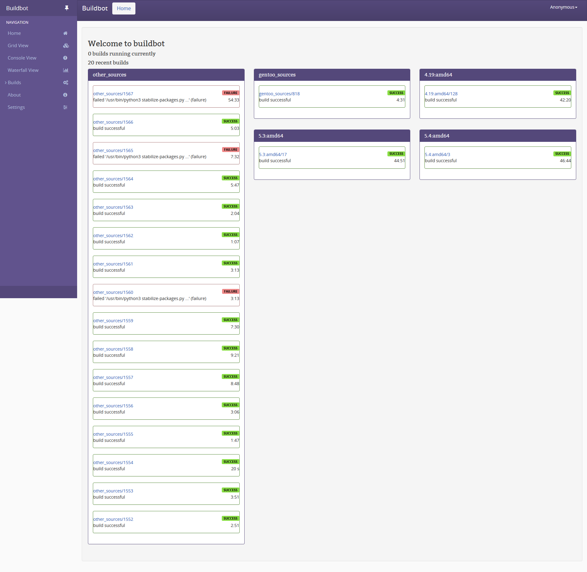

# Tyrian for Buildbot

_Gentoo Theme for Buildbot._

## Installation

### PyPI

```sh
pip install buildbot-tyrian-theme
```

### Source

```sh
pip install -r requirements.txt
python setup.py install
```

## Usage

Add the plugin to the `master.cfg` file:

```python
c['www'] = dict(port=8010,
                plugins=dict(waterfall_view={}, console_view={}, grid_view={}, tyrian_view={}))
```

### Example

An example configuration has been provided, (See: [`doc/example/master.cfg`](doc/example/master.cfg)).

To view the example,

```sh
cd example
buildbot create-master
buildbot start
```

### Screenshot



Courtesy of <https://kernel-ci.emjay-embedded.co.uk>.

## License

SPDX-License-Identifier: [GPL-3.0-or-later][license]

## Reference

- [How to package Buildbot plugins][buildbot-plugins]

- [Tyrian – The new look of gentoo.org][tyrian]

[license]: https://spdx.org/licenses/GPL-3.0-or-later.html
[license-badge]: https://img.shields.io/badge/license-GPL--3.0--or--later-blue.svg?style=flat-square
[buildbot-plugins]: https://docs.buildbot.net/current/developer/plugins-publish.html
[tyrian]: https://gitweb.gentoo.org/sites/tyrian-theme.git
